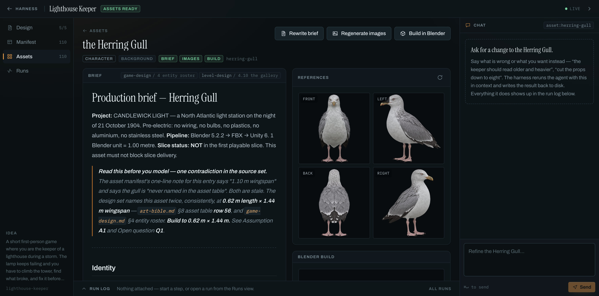
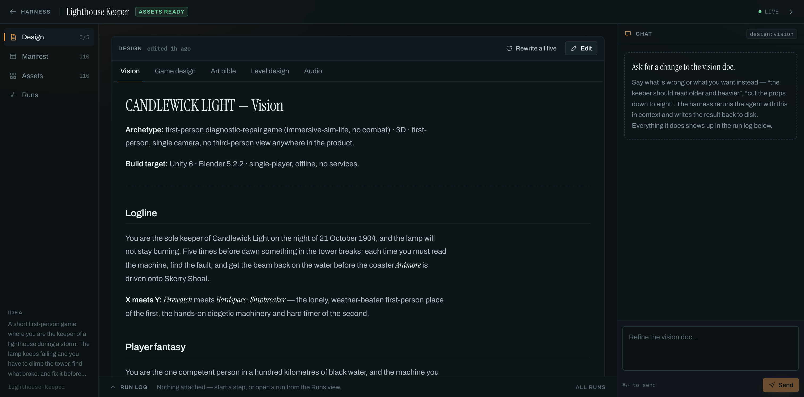
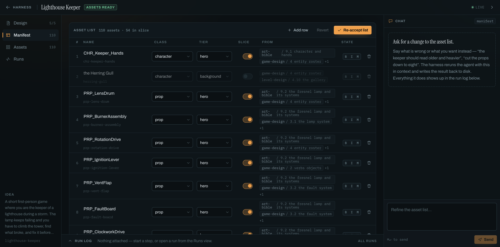
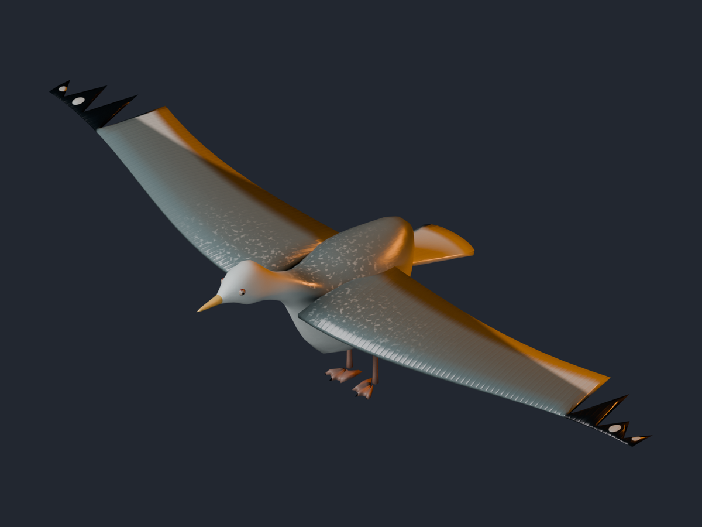

# gamedev-vm

Two things live here:

1. **[The harness](harness/)** — turns a game idea into design docs, per-asset briefs with reference images, and Blender-built Unity assets. You run it on your own machine and drive it from a browser.
2. **The VM provisioner** — one script that turns a fresh Ubuntu VM into a Unity + Blender workstation. Documented below.

---

## The harness

```
"a first-person game where you play a lighthouse keeper during a storm"
        ↓  five design docs — vision, game design, art bible, level design, audio
        ↓  the asset list the docs imply, which you review and accept
        ↓  per asset: a production brief, then four reference views
        ↓  per asset: a rigged mesh, checked against the brief, then rendered
```

Each step runs as a job you watch: the web UI streams the agent's tool calls and output live over a websocket, and a chat panel scoped to whatever you are looking at reruns the agent to change it. Everything it writes is plain files in `projects/<name>/`, so you can read, edit and commit them.



One asset — its brief on the left, its four generated reference views on the right, the built mesh below, and a chat panel that changes any of it. The provenance chips under the title say which design-doc sections the brief came from.

<table>
<tr>
<td width="50%"></td>
<td width="50%"></td>
</tr>
<tr>
<td>The five design docs, editable in place. Changing one marks every brief derived from it stale.</td>
<td>The 110 assets derived from those docs. Nothing is generated until you accept the list — a wrong list otherwise multiplies into dozens of wrong briefs and paid image calls.</td>
</tr>
</table>

### Run it locally

Nothing is hosted — you start the server yourself and open it in a browser:

```bash
cd harness
uv sync
(cd web && npm install && npm run build)
OPENAI_API_KEY=sk-... uv run uvicorn app.main:app --port 8799
```

Then open **http://localhost:8799**.

It needs an agent CLI — [Codex](https://developers.openai.com/codex/cli) or [Claude Code](https://claude.com/claude-code) — for every step that writes something; an `OPENAI_API_KEY` for reference images (GPT Image 2.5); and Blender for the build step. The UI reports each of these honestly rather than failing silently, so you can start with just one of them installed. See [harness/README.md](harness/README.md) for the full setup, the runtime choice and the layout.

### A worked example

[`projects/lighthouse-keeper/`](projects/lighthouse-keeper/) is one idea taken end to end: 1,447 lines of design docs, 110 derived assets, and the herring gull carried all the way through a 56 KB brief, four reference views, a 3,072-triangle rigged mesh that passed 27 of 27 dimensional and topology checks, and this render — materials and lighting built from the art bible's own hex palette:



The bird is in its bind pose — wings flat at 0° dihedral — because the brief asks for exactly that, so the 1.44 m wingspan is measurable straight off the bounding box. The perched and sheltering poses are animation clips on its nine-bone rig.

The three plans behind it are in [`plans/`](plans/).

---

## The VM provisioner

One script that turns a fresh Ubuntu 22.04/24.04 x86_64 VM (ideally with an NVIDIA GPU) into a Unity + Blender workstation that you open in a web browser.

It installs:
- the latest Unity 6 LTS editor
- Unity Hub
- Blender
- Firefox, which Unity Hub opens when you sign in
- a desktop you open in the browser (XFCE over KasmVNC, `https://<vm-ip>:8444`)
- VirtualGL, so the apps run on the GPU when there is one

Licences and passwords go into one private S3-compatible bucket, encrypted before upload. You enter them once, and every later machine needs only a token.

## First machine

```bash
curl -fsSLO <where-setup.sh-is-hosted>/setup.sh
sudo bash setup.sh
```

The script asks everything up front, then runs unattended:

1. **Store**: an S3-compatible endpoint, bucket and access key (AWS S3, Cloudflare R2 or MinIO). The bucket must already exist.
2. **Your name**: shown next to the seat this machine holds.
3. **Unity licence**:
   - Personal: the account email.
   - Pro: email, password and serial.
   - Both: how many machines may use the licence at once.
4. **Desktop password**: press Enter to have one generated.

With **Unity Pro**, nothing is manual. The serial is activated on each machine and returned to Unity when the machine shuts down, so a new machine needs only the token.

With **Unity Personal**, each machine needs its own one-time sign-in. The script prints the steps and waits:

1. Open the browser desktop.
2. Open Unity Hub and sign in.
3. Go to Preferences > Licenses > Add > Get a free personal license.

Under Unity 6, Personal is a *named-user* licence: Unity issues it against the Hub sign-in on that machine and keeps the entitlement behind an access token that lives with that sign-in. Copying the licence file to another machine does not work — tested against Unity's licensing service, the second machine reports "Found 0 entitlement groups and 0 free entitlements" and refuses to start, in both batch mode and the editor window. So for Personal, the store carries the settings, the desktop password and the seat record, but not a reusable licence.

If you hold an older serial-style licence file (`Unity_lic.ulf`), that kind does travel, and you can hand it over directly:

```bash
sudo gamedev-vm license import /path/to/Unity_lic.ulf
```

## Every later machine

```bash
sudo gamedev-vm token          # on any set-up machine; keep this in a password manager
sudo GAMEDEV_TOKEN=gdv1.... bash setup.sh   # on the new VM, no questions asked
```

## Reaching the desktop

The desktop listens on port 8444 with a self-signed certificate and a password, so browsers show a certificate warning the first time. Open the VM's firewall or security group for port 8444 to your own IP only.

## Seats: who is using which licence

While a machine runs, it holds a Unity seat:
- It renews the seat every 5 minutes.
- It gives the seat back on shutdown. A Pro licence is returned to Unity; a Personal licence file is saved back to the store and removed from the machine (so the seat record matches what is actually in use).
- If a machine dies without shutting down, its seat counts as abandoned after 20 minutes, and the next machine that asks takes it over.

```bash
sudo gamedev-vm license status    # seat table + recent activity (claims, releases, takeovers)
sudo gamedev-vm license release   # free this machine's seat now
sudo gamedev-vm license claim     # take a seat once one frees up (the timer also retries)
sudo gamedev-vm license save      # upload this machine's Unity licence after signing in
sudo gamedev-vm license import F  # take a licence file created on your own computer
sudo gamedev-vm license reset     # change the stored Unity details
sudo gamedev-vm info              # desktop address, password, versions
```

If every seat is taken, the install still finishes, with Unity unlicensed on that machine. `license status` shows who holds each seat.

## What is in the bucket

| Key | Contents |
|---|---|
| `vault/*.gpg` | Unity details, the Unity licence files and the desktop password. AES-256 encrypted with the passphrase inside the token. |
| `seats/unity-N.json` | Current holder of seat N: user, host, IP, since, last renewal. Written with conditional writes, so two machines can never take the same seat. |
| `log/*.json` | Activity history. |

Anyone with the token can read everything, so treat the token like a password.

## Options

Set these as environment variables, placed after `sudo` (for example `sudo UNITY_VERSION=6000.0.84f1 bash setup.sh`):
- `UNITY_VERSION`: for example `6000.3.24f1`. The default is the newest Unity 6 LTS.
- `BLENDER_VERSION`: the default is `5.2.2`.
- `GAMEDEV_SKIP`: a comma-separated list from `gpu,desktop,browser,blender,hub,unity-editor`.
- `GAMEDEV_NONINTERACTIVE=1`: never prompt.

Every question can also be answered through the environment; the list is at the top of `setup.sh`.

## GPU choice

H100, H200 and A100 are compute cards with almost no graphics hardware. Blender renders (Cycles) run fast on them, but the Unity and Blender viewports are slow. For editing, use an RTX-class card, such as an L40S, RTX 6000, A10 or L4.

## Tests

`test/run.sh` runs the licence and store scenarios against a real MinIO server and two fake VMs (systemd containers). It takes minutes. The scenarios are:
- first-machine setup
- only ciphertext in the bucket
- one-time sign-in saved to the store
- a second machine that needs only the token and waits for a seat
- a seat moving on shutdown
- takeover of an abandoned seat
- two machines racing for the last seat
- bad tokens

The full install is exercised with `docker compose up -d` in `test/` and then running `setup.sh` in `vm1`.
